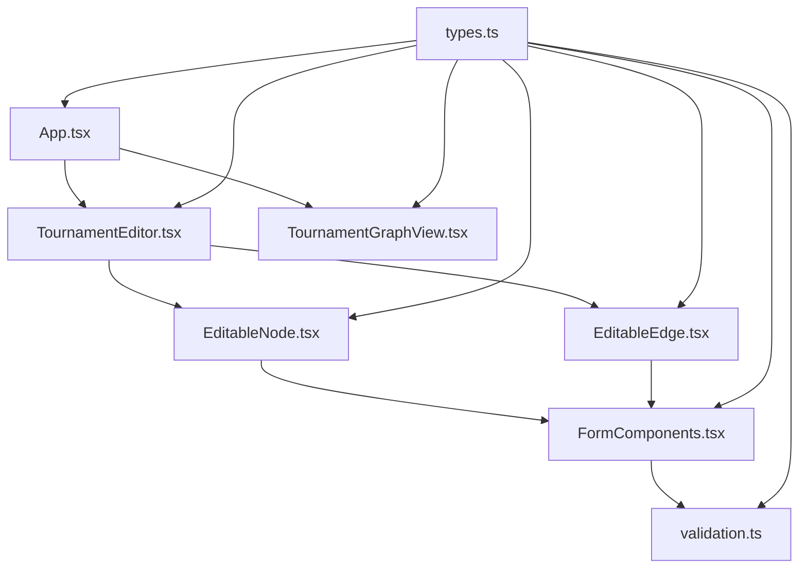

# Tournament Graph Editor - Active Context

## Estado Actual
✅ **IMPLEMENTACIÓN COMPLETADA** - Todas las funcionalidades principales han sido implementadas exitosamente.

### 🔧 Mejoras Recientes (2024-12-30)

#### ✅ Lógica de Switch para Edges (2024-12-30 - NUEVA FUNCIONALIDAD)
Se implementó una lógica completa de "switch" para edges que transforma el comportamiento del flujo de torneos:

**🎯 Funcionalidad de Switch:**
- **Primer Edge Default**: El primer edge que sale de un nodo se marca automáticamente como 'default' y no requiere condición
- **Label "Default"**: Los edges default muestran claramente "default" en azul en lugar de condiciones matemáticas
- **Edición Condicional**: Solo los edges adicionales (no-default) pueden editarse para establecer condiciones específicas
- **Gestión Automática**: El sistema garantiza que siempre haya exactamente un edge default por nodo

**🎨 Coloreado Inteligente de Edges:**
- **Edges Rojos**: Conexiones a sinks de eliminación/descalificación (`#fc5f53`)
- **Edges Verdes**: Conexiones a sinks de podio (`#44c753`)
- **Edges Azules**: Conexiones a sinks de calificación (`#2563EB`)
- **Edges Grises**: Conexiones normales entre nodos (`#AAAAAA`)

**⚙️ Implementación Técnica:**
- **Nuevo archivo**: `src/utils/edgeLogic.ts` con funciones utility para la lógica de switch
- **Tipo extendido**: `GraphEdge` ahora incluye propiedad `isDefault?: boolean`
- **Validación automática**: Función `validateDefaultEdges()` asegura consistencia
- **Integración completa**: Todas las formas de crear edges (manual, proximity, drag) respetan la lógica

**📋 Casos de Uso:**
1. **Nodo con un solo edge**: Se comporta como default pero es editable
2. **Primer edge de múltiples**: Marcado como default, editable, muestra "default"
3. **Edges adicionales**: Editables, muestran condiciones, coloreados según destino
4. **Migración de datos**: Edges existentes se validan automáticamente al cargar

**🔧 Funcionalidad de Edición Mejorada (2024-12-30 - ACTUALIZACIÓN):**
- **Todos los edges editables**: Incluso los edges default ahora muestran el botón de edición ✏️
- **Opción "Default" en formulario**: Select incluye "Default" como primera opción
- **Formulario adaptativo**: Cuando se selecciona "Default", se ocultan automáticamente los campos de operador y valor
- **Validación inteligente**: Campo "default" siempre es válido sin requerir operador ni valor
- **UX consistente**: Todos los edges tienen la misma interfaz de edición

#### ✅ Gestión Inteligente de Podios (2024-12-30 - NUEVA FUNCIONALIDAD AVANZADA)
Se implementó un sistema completo de gestión de nodos podio con auto-incremento y validación en tiempo real:

**🎯 Auto-Incremento en Copia:**
- **Copia inteligente**: Al copiar un nodo podio, automáticamente asigna la siguiente posición disponible
- **Posiciones consecutivas**: Si existe podio posición 1, la copia será posición 2 automáticamente
- **Algoritmo eficiente**: Encuentra la primera posición libre (1, 2, 3...) sin gaps

**⚠️ Validación de Duplicados:**
- **Validación en tiempo real**: Impide guardar podios con posiciones duplicadas
- **Mensaje de error claro**: Texto rojo debajo del input explicando el conflicto específico
- **Verificación cruzada**: Compara contra todos los nodos del grafo en tiempo real

**🎨 Migración a React Hook Form + shadcn:**
- **Formularios modernos**: SinkConfigForm completamente reescrito con react-hook-form
- **Componentes shadcn**: Usa Input, Select, Form components oficiales de shadcn/ui
- **Validación con Zod**: Schema de validación tipado y robusto
- **UX mejorada**: Feedback visual inmediato y consistente con el resto de la aplicación

#### ✅ Botón de Edición Arreglado
Se corrigió un problema donde el botón de edición no aparecía en nodos cuando no estaban en modo edición. El problema era una condición lógica incorrecta que dependía de `data.editable` en lugar de verificar la disponibilidad del callback `onStartEditing`.

#### ✅ Handles de Conexión Mejorados
Los handles (puntos de conexión) han sido significativamente mejorados:
- **Siempre Visibles**: No requieren modo edición para aparecer
- **Tamaño Aumentado**: De 12px a 20px para mejor visibilidad y facilidad de uso
- **Mejor Feedback**: Hover azul y sombras para indicar interactividad
- **Posicionamiento Centrado**: Offset ajustado para alineación perfecta

#### ✅ Proximity Connect Implementado
Se implementó la funcionalidad de [proximity connect de React Flow](https://reactflow.dev/examples/nodes/proximity-connect) que permite:
- **Conexión Automática**: Al arrastrar un nodo cerca de otro (distancia < 150px), se muestra una línea punteada azul
- **Creación Automática de Edges**: Al soltar el nodo cerca, se crea automáticamente una conexión entre los nodos
- **Feedback Visual**: Las conexiones temporales se muestran con línea punteada azul durante el arrastre

#### ✅ Edges Animados y Seleccionables (2024-12-30)
Se mejoraron significativamente los edges con:
- **Líneas Animadas Dashed**: Todas las conexiones ahora tienen líneas punteadas animadas que simulan flujo de datos
- **Dirección Correcta**: Animación fluye de source a target (izquierda a derecha) como grafos dirigidos
- **Selección Clara**: Edges seleccionados se muestran como línea negra sólida SIN animación
- **Mejor Selección**: Área de click más grande (invisible) para facilitar la selección de edges
- **Eliminación Mejorada**: Edges completamente seleccionables con tecla Delete
- **Feedback Visual**: Estados distintivos (animado/sólido) según selección
- **Status Bar Mejorado**: Información clara sobre edges seleccionados con instrucciones
- **Formulario Optimizado**: Input number compacto (w-14) y botones rectangulares más grandes
- **UX Mejorada**: Botones "Save" y "Cancel" con texto claro en lugar de símbolos

#### ✅ Nodos Sink Simplificados (2024-12-30)
Se rediseñó completamente la interfaz de nodos Sink para mayor simplicidad:
- **Sin Selección de Tipo**: Elimina NodeTypeSelector ya que el tipo está fijo como "sink"
- **ID Oculto**: No muestra información de ID del nodo para interface más limpia
- **Solo Dos Opciones**: Tipos disponibles limitados a "Podio" y "Eliminación"
- **Campo de Posición**: Para tipo "Podio" incluye selector numérico de posición (1-10)
- **Interface Simplificada**: Para tipo "Eliminación" no requiere campos adicionales
- **Mejor UX**: Etiquetas en español y configuración más intuitiva

## Funcionalidades Implementadas

### ✅ Sistema de Tipos Extendido
- Nuevos tipos para condiciones de edges (`EdgeCondition`, `ConditionOperator`)
- Configuración de nodos sink (`SinkConfiguration`, `SinkType`)
- Propiedades editables en nodos y edges
- Metadata para configuración global del grafo

### ✅ Componentes de Formulario (`FormComponents.tsx`)
- `FormField`: Componente base con validación
- `NodeTypeSelector`: Selector visual para tipos de nodo
- `SinkConfigEditor`: Configuración específica para nodos sink
- `EdgeConditionEditor`: Editor de condiciones para edges
- `EditToggle`: Toggle visual para modo edición

### ✅ Nodos Editables (`EditableNode.tsx`)
- Formularios integrados dentro de nodos
- Configuración de tipo, capacidad y propiedades específicas
- Validación en tiempo real con feedback visual
- Estados de edición con botones Save/Cancel
- Soporte completo para nodos: match, aggregator, sink

### ✅ Edges Editables (`EditableEdge.tsx`)
- Editor flotante de condiciones en edges
- Operadores matemáticos: >=, <=, ==, !=, >, <
- Campos configurables: points, position, score
- Preview de condiciones en tiempo real
- Validación de sintaxis

### ✅ Editor Principal (`TournamentEditor.tsx`)
- Canvas interactivo con React Flow
- Toolbar con controles de modo (Edit/View)
- Creación de nodos arrastrando botones
- Conexión de nodos con drag & drop
- Exportación de configuración como JSON
- Reset de layout automático
- Status bar informativo

### ✅ Aplicación Principal (`App.tsx`)
- Toggle entre modo Editor y Viewer
- Estado global del grafo
- Header informativo y navegación
- Integración completa de componentes

## Flujo de Trabajo Completado

### Modo Edición
1. **Crear Nodos**: Botones + Match/Aggregator/Sink
2. **Configurar Nodos**: Click en ✏️ Edit → Formularios inline
3. **Conectar Nodos**: Arrastrar desde handle derecho a handle izquierdo
4. **Configurar Edges**: Click en ✏️ Edit en edge → Editor de condiciones
5. **Exportar**: Botón 💾 Export JSON → Descarga automática

### Modo Vista
- Visualización de solo lectura
- Todos los datos visibles
- Layout optimizado
- Navegación con MiniMap y controles

## Arquitectura Final

## Características Técnicas Implementadas

### 🎯 Funcionalidades Core
- ✅ Nodos editables como formularios
- ✅ Edges con condiciones matemáticas
- ✅ Creación interactiva de nodos
- ✅ Conexión drag & drop
- ✅ Exportación JSON

### 🛠️ Características Técnicas
- ✅ TypeScript estricto sin errores
- ✅ Validación en tiempo real
- ✅ Componentes modulares y reutilizables
- ✅ Estado sincronizado entre componentes
- ✅ Performance optimizada con memoización

### 🎨 UX/UI
- ✅ Diseño moderno con Tailwind CSS
- ✅ Feedback visual para estados de edición
- ✅ Validación con mensajes de error claros
- ✅ Transiciones suaves y responsivas
- ✅ Iconografía intuitiva

## Próximos Pasos (Opcionales)
- Agregar undo/redo funcionalidad
- Implementar import de configuraciones
- Agregar templates de torneos predefinidos
- Mejorar validación de integridad del grafo
- Agregar modo de simulación/preview

## Estado Final
🎉 **PROYECTO COMPLETADO EXITOSAMENTE**

Todas las funcionalidades solicitadas han sido implementadas:
1. ✅ Nodos editables con formularios
2. ✅ Edges con condiciones configurables  
3. ✅ Creación interactiva de componentes
4. ✅ Exportación de configuración JSON
5. ✅ UI moderna e intuitiva

La aplicación está lista para uso y puede ejecutarse con `npm run dev`.