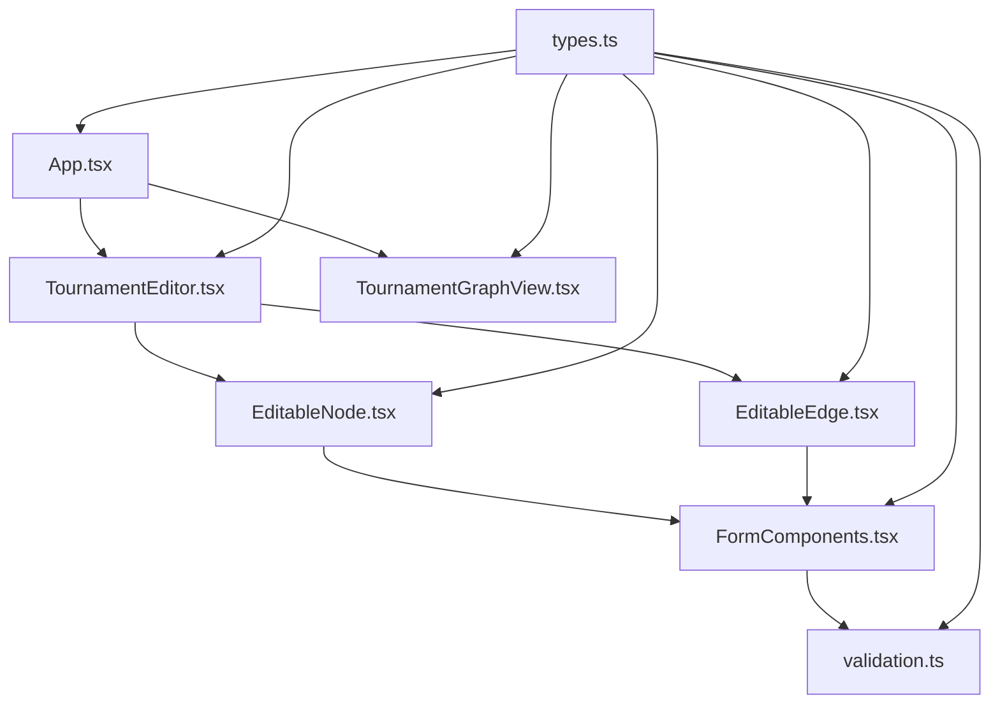

# Tournament Graph Editor - Active Context

## Estado Actual
✅ **IMPLEMENTACIÓN COMPLETADA** - Todas las funcionalidades principales han sido implementadas exitosamente.

## Funcionalidades Implementadas

### ✅ Sistema de Tipos Extendido
- Nuevos tipos para condiciones de edges (`EdgeCondition`, `ConditionOperator`)
- Configuración de nodos sink (`SinkConfiguration`, `SinkType`)
- Propiedades editables en nodos y edges
- Metadata para configuración global del grafo

### ✅ Componentes de Formulario (`FormComponents.tsx`)
- `FormField`: Componente base con validación
- `NodeTypeSelector`: Selector visual para tipos de nodo
- `SinkConfigEditor`: Configuración específica para nodos sink
- `EdgeConditionEditor`: Editor de condiciones para edges
- `EditToggle`: Toggle visual para modo edición

### ✅ Nodos Editables (`EditableNode.tsx`)
- Formularios integrados dentro de nodos
- Configuración de tipo, capacidad y propiedades específicas
- Validación en tiempo real con feedback visual
- Estados de edición con botones Save/Cancel
- Soporte completo para nodos: match, aggregator, sink

### ✅ Edges Editables (`EditableEdge.tsx`)
- Editor flotante de condiciones en edges
- Operadores matemáticos: >=, <=, ==, !=, >, <
- Campos configurables: points, position, score
- Preview de condiciones en tiempo real
- Validación de sintaxis

### ✅ Editor Principal (`TournamentEditor.tsx`)
- Canvas interactivo con React Flow
- Toolbar con controles de modo (Edit/View)
- Creación de nodos arrastrando botones
- Conexión de nodos con drag & drop
- Exportación de configuración como JSON
- Reset de layout automático
- Status bar informativo

### ✅ Aplicación Principal (`App.tsx`)
- Toggle entre modo Editor y Viewer
- Estado global del grafo
- Header informativo y navegación
- Integración completa de componentes

## Flujo de Trabajo Completado

### Modo Edición
1. **Crear Nodos**: Botones + Match/Aggregator/Sink
2. **Configurar Nodos**: Click en ✏️ Edit → Formularios inline
3. **Conectar Nodos**: Arrastrar desde handle derecho a handle izquierdo
4. **Configurar Edges**: Click en ✏️ Edit en edge → Editor de condiciones
5. **Exportar**: Botón 💾 Export JSON → Descarga automática

### Modo Vista
- Visualización de solo lectura
- Todos los datos visibles
- Layout optimizado
- Navegación con MiniMap y controles

## Arquitectura Final

## Características Técnicas Implementadas

### 🎯 Funcionalidades Core
- ✅ Nodos editables como formularios
- ✅ Edges con condiciones matemáticas
- ✅ Creación interactiva de nodos
- ✅ Conexión drag & drop
- ✅ Exportación JSON

### 🛠️ Características Técnicas
- ✅ TypeScript estricto sin errores
- ✅ Validación en tiempo real
- ✅ Componentes modulares y reutilizables
- ✅ Estado sincronizado entre componentes
- ✅ Performance optimizada con memoización

### 🎨 UX/UI
- ✅ Diseño moderno con Tailwind CSS
- ✅ Feedback visual para estados de edición
- ✅ Validación con mensajes de error claros
- ✅ Transiciones suaves y responsivas
- ✅ Iconografía intuitiva

## Próximos Pasos (Opcionales)
- Agregar undo/redo funcionalidad
- Implementar import de configuraciones
- Agregar templates de torneos predefinidos
- Mejorar validación de integridad del grafo
- Agregar modo de simulación/preview

## Estado Final
🎉 **PROYECTO COMPLETADO EXITOSAMENTE**

Todas las funcionalidades solicitadas han sido implementadas:
1. ✅ Nodos editables con formularios
2. ✅ Edges con condiciones configurables  
3. ✅ Creación interactiva de componentes
4. ✅ Exportación de configuración JSON
5. ✅ UI moderna e intuitiva

La aplicación está lista para uso y puede ejecutarse con `npm run dev`.