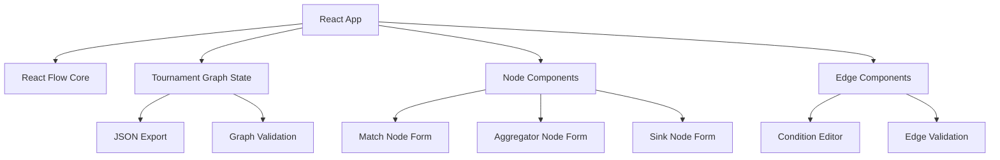

# Tournament Graph Editor - System Patterns

## Arquitectura General

## Patrones de Diseño Clave

### 1. Component Composition Pattern
- **NodeEditor**: Componente base con formularios específicos por tipo
- **EdgeEditor**: Componente reutilizable para condiciones
- **GraphCanvas**: Contenedor principal que maneja estado global

### 2. State Management Pattern
- **Local State**: Formularios de nodos y edges individuales
- **Lifted State**: Configuración global del grafo en componente padre
- **Event Driven**: Cambios propagados via callbacks de React Flow

### 3. Type-Safe Validation Pattern
- **Runtime Validation**: Validación en tiempo real de formularios
- **Graph Validation**: Verificación de conectividad y lógica del flujo
- **Export Validation**: Asegurar JSON válido antes de exportar

## Decisiones Técnicas Clave

### React Flow Integration
- **Nodos Personalizados**: Cada tipo de nodo es un componente React separado
- **Handles Configurables**: Posiciones dinámicas basadas en configuración
- **Event Handling**: Captura de eventos de conexión y edición

### Estado y Persistencia
- **Inmutable Updates**: Uso de patrones inmutables para actualizaciones
- **JSON Schema**: Esquema bien definido para import/export
- **Backward Compatibility**: Mantener compatibilidad con datos existentes

### Componentes Reutilizables
- **FormField**: Componente base para inputs con validación
- **ConditionSelector**: Selector reutilizable para operadores
- **NodeTypeSelector**: Selector visual para tipos de nodo

## Relaciones Entre Componentes

### Data Flow
1. **User Input** → Node/Edge Forms
2. **Form Changes** → Local State Updates  
3. **State Changes** → Graph State Updates
4. **Graph Updates** → React Flow Re-render
5. **Export Trigger** → JSON Generation

### Component Hierarchy
- **TournamentGraphEditor** (Root)
  - **ReactFlow** (Canvas)
    - **MatchNode** (Editable)
    - **AggregatorNode** (Editable)  
    - **SinkNode** (Editable)
    - **ConditionalEdge** (Editable)
  - **Toolbar** (Actions)
  - **ExportPanel** (JSON Output)

## Performance Considerations
- **Memoization**: React.memo para nodos que no cambian
- **Debounced Updates**: Evitar re-renders excesivos en formularios
- **Lazy Loading**: Cargar formularios complejos solo cuando necesario
